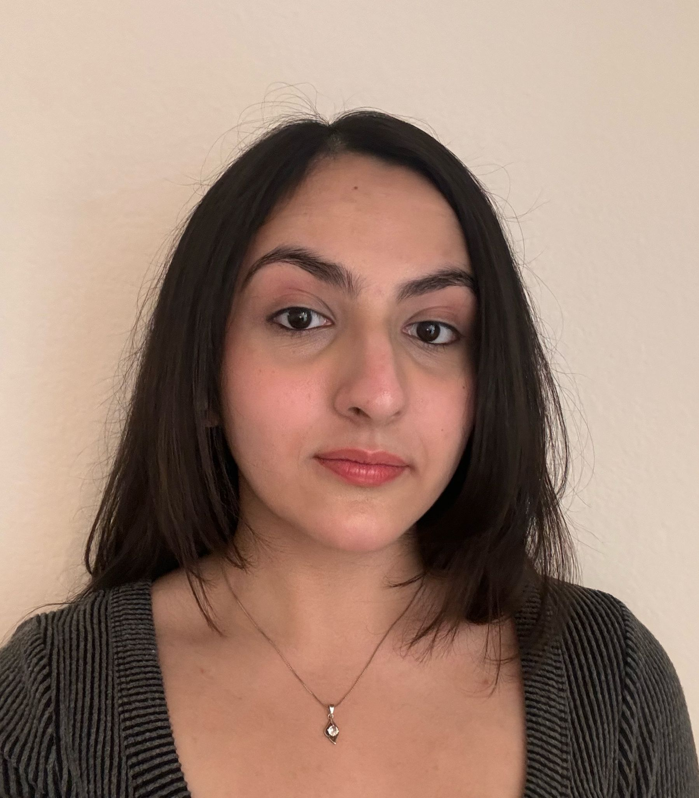

# Suhani Srivastava-



## Introduction

Hi! I'm **Suhani Srivastava** — a *Computer Engineering student at the University of California, San Diego*. I’m passionate about learning new technologies, building creative projects, and using code to make life better and easier. As a person and a programmer, I thrive in diverse environments that challenge me and help me grow.

## Background as a Programmer

I’ve explored a wide variety of topics in computer science and engineering, including:

- Object-Oriented Programming in Java  
- Systems Programming in C  
- Data Structures and Algorithms  
- Digital Logic and System Design  
- Computer Architecture  
- Data Science & Machine Learning Concepts  

I’ve worked on several exciting projects and internships:

> “Designed an interactive 3D e-commerce site using HTML, CSS, JavaScript, and Three.js during my internship at Codalien Technologies.”

```python
# Sample code: 
def detect_mask(image):
    if is_masked(image):
        return "Masked"
    else:
        return "No Mask"
```

You can check out more of my experiences and projects in my [Resume](RESUME_Suhani.pdf).

## Hobbies and Other Interests

In addition to programming, I love to express myself through the arts and music. Some of my favorite things to do include:

1. Dancing – I’ve been trained in Kathak, a classical Indian dance form.
2. Playing the Keyboard – I enjoy composing and covering music.
3. Listening to Music – It helps me relax and inspires creativity.
4. Meditation and staying mindful through movement and rhythm.

## Explore More

- [x] [Visit my LinkedIn Profile](https://linkedin.com/in/suhanisrivastava)
- [x] [Jump to Introduction](#introduction)
- [x] [Download my Resume](RESUME_Suhani.pdf)
- [x] [Link to image](suhani-photo.jpeg)

